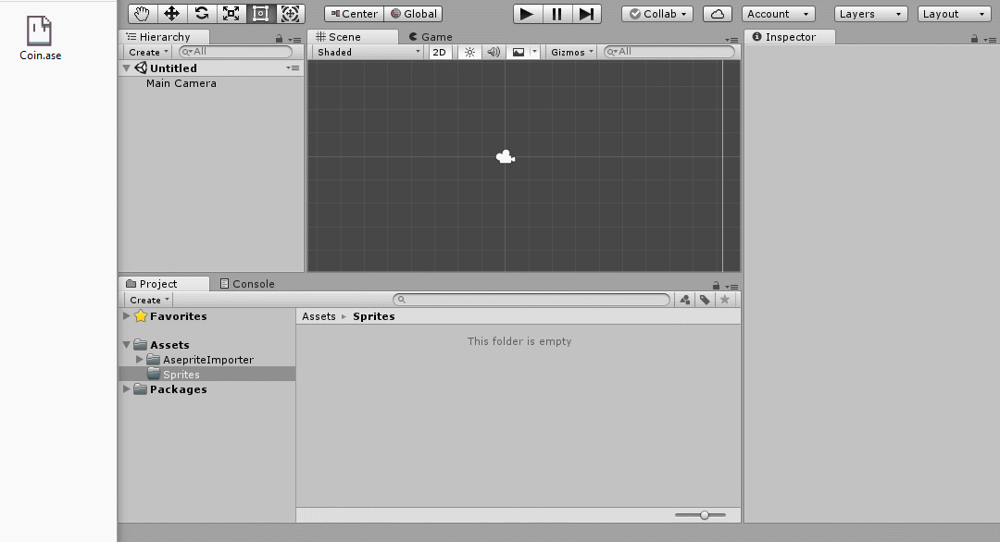
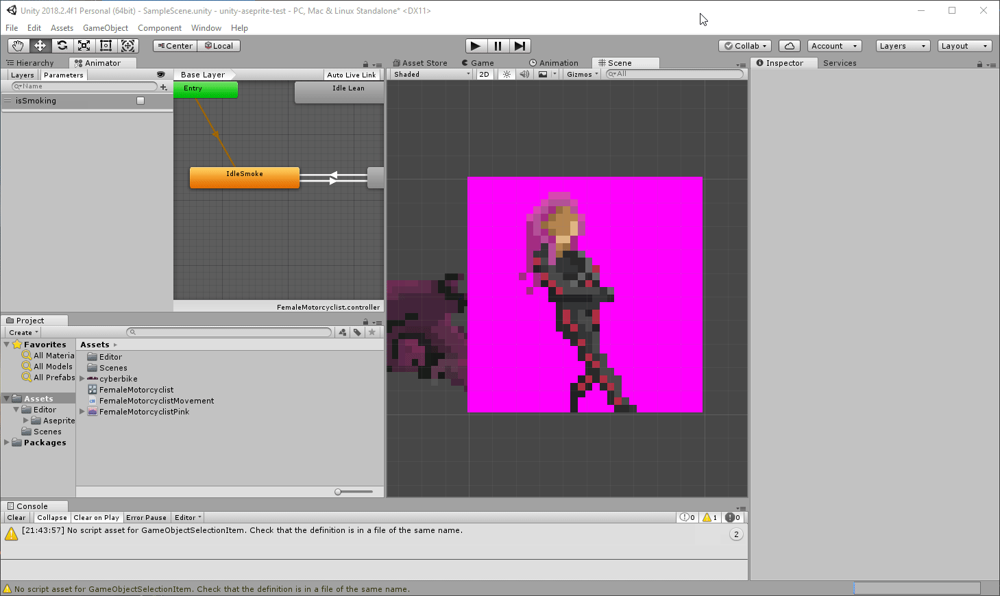

# Aseprite-Importer for Unity


This package helps you importing [.ase files](https://github.com/aseprite/aseprite/blob/master/docs/ase-file-specs.md) from [aseprite](https://www.aseprite.org/). The reader is fully written in C# which reads the compressed binary file and creates spritesheets, sprites and animations out of it.


## Usage
Import the ```unity-aseprite-importer``` folder into your project's Packages folder. Now it should import all newly added .ase-files automatically. Already imported assets do need a manual re-import.





## License

See LICENSE file.

Note: As of Unity doesn't include any editor scripts in the game, you don't have to license your game under GPL.
